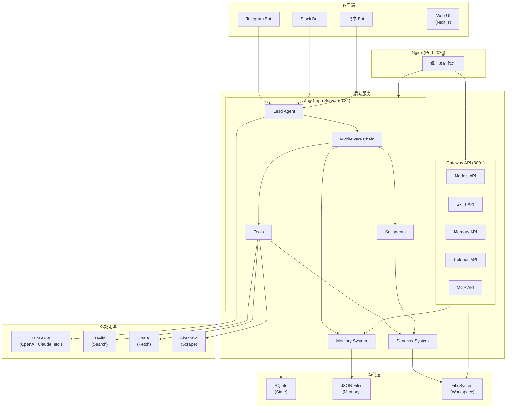
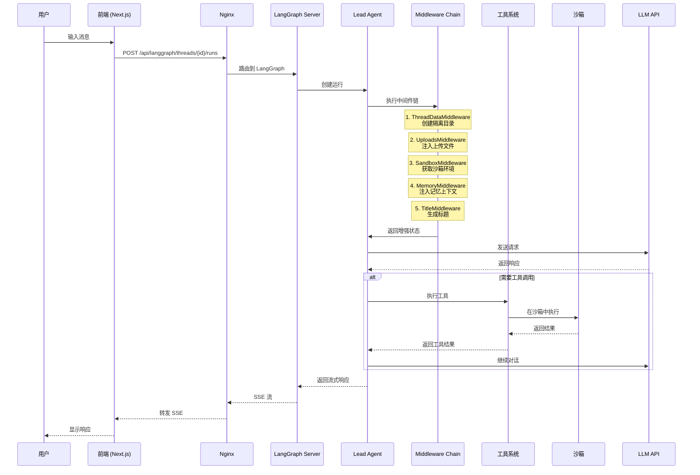
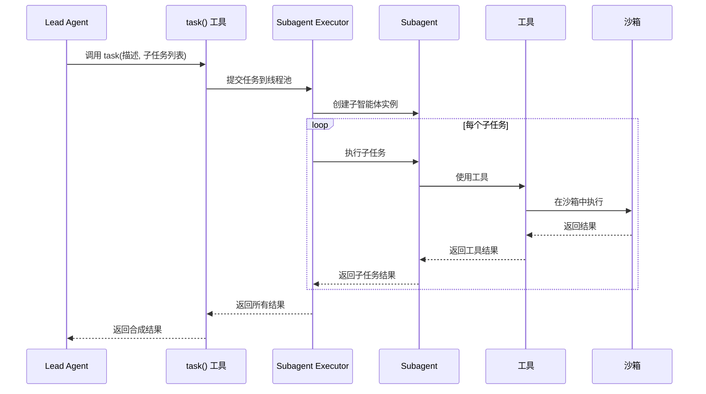

# DeerFlow 系统架构文档

## 概述

DeerFlow（Deep Exploration and Efficient Research Flow）是一个开源的超级智能体平台（Super Agent Harness），基于 LangGraph 和 LangChain 构建。它协调子智能体、记忆系统和沙箱环境，通过可扩展的技能系统来完成几乎任何任务。

DeerFlow 从最初的深度研究框架演变为一个功能完整的智能体运行时，提供了智能体所需的完整基础设施：文件系统、记忆系统、技能、沙箱执行环境，以及为复杂多步骤任务规划和生成子智能体的能力。它使开发者能够构建能够实际"做事"的 AI 应用，而不仅仅是对话。

系统支持多种大语言模型（OpenAI、Claude、DeepSeek、Gemini 等），提供了完整的工具生态系统（网络搜索、文件操作、代码执行等），并通过沙箱隔离确保安全执行。其独特的子智能体系统允许主智能体将复杂任务分解为并行执行的子任务，然后合成最终结果。

## 技术栈

### 语言与运行时

- **Python 3.12+** - 后端主要语言
- **TypeScript** - 前端主要语言
- **Node.js 22+** - 前端运行时

### 框架

- **LangGraph 1.0+** - 智能体编排和状态管理
- **LangChain 1.2+** - LLM 交互和工具链
- **FastAPI 0.115+** - 后端 REST API 框架
- **Next.js 16.1+** - 前端 Web 框架
- **React 19** - 前端 UI 库

### 数据存储

- **SQLite** - 通过 langgraph-checkpoint-sqlite 进行状态持久化
- **JSON 文件** - 用户记忆存储
- **本地文件系统** - 沙箱工作空间和上传文件

### 基础设施

- **Docker** - 沙箱容器运行时
- **Kubernetes** - 可选的容器编排（通过 provisioner）
- **Nginx** - 反向代理和请求路由
- **uv** - Python 包管理器
- **pnpm** - Node.js 包管理器

### 外部服务

- **Tavily API** - 网络搜索服务
- **Jina AI API** - 网页抓取服务
- **Firecrawl API** - 网页爬虫服务
- **DuckDuckGo** - 图片搜索
- **InfoQuest** - BytePlus 智能搜索工具
- **MCP 服务器** - 可扩展的工具协议服务器

## 项目结构

```
deer-flow/
├── backend/                    # Python 后端
│   ├── src/                    # 应用源代码
│   │   ├── agents/             # 智能体系统
│   │   │   ├── lead_agent/     # 主智能体
│   │   │   ├── middlewares/    # 中间件链
│   │   │   ├── checkpointer/   # 状态检查点
│   │   │   └── memory/         # 记忆系统
│   │   ├── channels/           # IM 渠道集成
│   │   │   ├── telegram.py     # Telegram Bot
│   │   │   ├── slack.py        # Slack Bot
│   │   │   └── feishu.py       # 飞书 Bot
│   │   ├── community/          # 社区工具和沙箱
│   │   │   ├── aio_sandbox/    # Docker 沙箱
│   │   │   ├── tavily/         # 搜索工具
│   │   │   ├── firecrawl/      # 爬虫工具
│   │   │   └── jina_ai/        # 网页抓取
│   │   ├── config/             # 配置管理
│   │   ├── gateway/            # FastAPI Gateway
│   │   ├── mcp/                # MCP 服务器集成
│   │   ├── models/             # LLM 模型封装
│   │   ├── sandbox/            # 沙箱抽象层
│   │   ├── skills/             # 技能加载器
│   │   ├── subagents/          # 子智能体系统
│   │   ├── tools/              # 内置工具
│   │   └── utils/              # 工具函数
│   ├── tests/                  # 测试套件
│   ├── docs/                   # 后端文档
│   ├── langgraph.json          # LangGraph 配置
│   └── pyproject.toml          # Python 依赖
├── frontend/                   # Next.js 前端
│   ├── src/                    # 应用源代码
│   │   ├── app/                # Next.js App Router
│   │   │   ├── workspace/      # 工作区页面
│   │   │   └── api/            # API 路由
│   │   ├── components/         # React 组件
│   │   │   ├── ui/             # UI 基础组件
│   │   │   ├── workspace/      # 工作区组件
│   │   │   └── ai-elements/    # AI 相关组件
│   │   ├── core/               # 核心业务逻辑
│   │   │   ├── api/            # API 客户端
│   │   │   ├── threads/        # 会话管理
│   │   │   ├── models/         # 数据模型
│   │   │   ├── skills/         # 技能系统
│   │   │   └── mcp/            # MCP 集成
│   │   ├── hooks/              # React Hooks
│   │   └── lib/                # 共享库
│   ├── public/                 # 静态资源
│   └── package.json            # Node.js 依赖
├── skills/                     # 技能定义
│   └── public/                 # 内置技能
│       ├── deep-research/      # 深度研究
│       ├── ppt-generation/     # PPT 生成
│       ├── image-generation/   # 图片生成
│       ├── video-generation/   # 视频生成
│       └── ...                 # 更多技能
├── docker/                     # Docker 配置
├── scripts/                    # 构建脚本
├── config.example.yaml         # 配置模板
└── Makefile                    # 构建命令

```

**入口点**

- `backend/langgraph.json` - LangGraph 服务器配置，定义 `lead_agent` 入口
- `backend/src/gateway/app.py` - Gateway API 应用入口
- `frontend/src/app/layout.tsx` - Next.js 根布局
- `frontend/src/app/workspace/page.tsx` - 工作区主页面
- `frontend/src/app/page.tsx` - 首页/落地页

## 子系统

### Lead Agent 子系统

**目的**: 系统的主智能体，作为所有用户交互的入口点，协调工具、子智能体和中间件

**位置**: `backend/src/agents/lead_agent/`

**关键文件**:
- `agent.py` - 主智能体创建逻辑，包含中间件链配置
- `prompt.py` - 系统提示词模板和技能注入

**依赖**: 模型配置、工具系统、沙箱系统、子智能体系统

**被依赖**: LangGraph 服务器、所有用户请求

### Middleware Chain 子系统

**目的**: 横切关注点的模块化处理，每个中间件负责一个特定功能

**位置**: `backend/src/agents/middlewares/`

**关键文件**:
- `thread_data_middleware.py` - 创建线程隔离目录
- `sandbox_middleware.py` - 获取沙箱环境
- `memory_middleware.py` - 异步记忆提取
- `clarification_middleware.py` - 拦截澄清请求
- `todo_middleware.py` - 计划模式任务跟踪
- `title_middleware.py` - 自动生成对话标题
- `view_image_middleware.py` - 视觉模型图片注入
- `uploads_middleware.py` - 上传文件注入

**依赖**: 沙箱系统、记忆系统、线程状态

**被依赖**: Lead Agent

### Sandbox 子系统

**目的**: 提供隔离的代码执行环境，支持本地和 Docker 两种模式

**位置**: `backend/src/sandbox/`, `backend/src/community/aio_sandbox/`

**关键文件**:
- `interface.py` - 沙箱抽象接口（`execute_command`, `read_file`, `write_file`）
- `local_provider.py` - 本地文件系统实现
- `community/aio_sandbox/provider.py` - Docker 容器实现

**依赖**: Docker（可选）、Kubernetes（可选）

**被依赖**: Middleware Chain、工具系统

### Subagent 子系统

**目的**: 异步任务委托和并发执行，支持复杂任务的分解

**位置**: `backend/src/subagents/`

**关键文件**:
- `executor.py` - 后台线程池执行器
- `registry.py` - 子智能体注册表
- `builtins/general_purpose.py` - 通用子智能体
- `builtins/bash_agent.py` - 命令专家子智能体

**依赖**: Lead Agent 配置、工具系统

**被依赖**: `task()` 工具、主智能体

### Memory 子系统

**目的**: 跨会话持久化用户上下文和知识，通过 LLM 驱动的记忆提取

**位置**: `backend/src/agents/memory/`

**关键文件**:
- `memory.py` - 记忆提取和存储逻辑
- 记忆存储格式：用户上下文、历史、置信度评分的事实

**依赖**: LLM 模型、JSON 文件存储

**被依赖**: MemoryMiddleware、系统提示词

### Gateway API 子系统

**目的**: 提供前端集成的 REST API，管理模型、技能、记忆、上传等

**位置**: `backend/src/gateway/`

**关键文件**:
- `app.py` - FastAPI 应用和路由定义
- `routes/models.py` - 模型管理端点
- `routes/skills.py` - 技能管理端点
- `routes/memory.py` - 记忆管理端点
- `routes/uploads.py` - 文件上传端点

**依赖**: 配置系统、记忆系统、技能系统

**被依赖**: 前端应用

### IM Channels 子系统

**目的**: 支持从即时通讯应用接收任务，无需公网 IP

**位置**: `backend/src/channels/`

**关键文件**:
- `telegram.py` - Telegram Bot 集成
- `slack.py` - Slack Socket Mode 集成
- `feishu.py` - 飞书 WebSocket 集成
- `manager.py` - 渠道管理器

**依赖**: LangGraph 服务器、Gateway API

**被依赖**: 外部 IM 平台

### Skills 子系统

**目的**: 领域特定工作流的模块化定义，通过系统提示词注入

**位置**: `skills/public/`, `skills/custom/`

**关键文件**:
- 每个 `SKILL.md` 文件定义一个技能
- `backend/src/skills/loader.py` - 技能发现和加载

**依赖**: 文件系统

**被依赖**: Lead Agent 系统提示词

### Frontend Workspace 子系统

**目的**: 提供用户界面，管理对话、文件、技能和设置

**位置**: `frontend/src/app/workspace/`, `frontend/src/components/workspace/`

**关键文件**:
- `page.tsx` - 工作区主页面
- `layout.tsx` - 工作区布局
- `components/workspace/chat/` - 聊天组件
- `components/workspace/artifacts/` - 文件和输出展示

**依赖**: LangGraph SDK、TanStack Query、Gateway API

**被依赖**: 用户交互

## 架构图

### 系统架构流程图



### 请求处理时序图



### 子智能体执行流程



## 数据流

### 用户消息处理流程

1. **用户输入**: 用户通过 Web UI 或 IM 渠道发送消息
2. **路由**: Nginx 将请求路由到 LangGraph Server 或 Gateway API
3. **中间件处理**: 
   - ThreadDataMiddleware 创建线程隔离目录
   - UploadsMiddleware 注入上传的文件
   - SandboxMiddleware 获取沙箱环境
   - MemoryMiddleware 注入用户记忆
4. **智能体执行**: Lead Agent 调用 LLM，可能触发工具调用
5. **工具执行**: 在沙箱环境中执行工具（bash、文件操作等）
6. **子智能体**: 复杂任务分解为子智能体并行执行
7. **响应流式返回**: 通过 SSE 流式返回给前端
8. **记忆更新**: 异步提取对话内容更新用户记忆

### 沙箱文件系统映射

```
容器内路径                    物理路径
/mnt/user-data/workspace/    → {thread_dir}/workspace/
/mnt/user-data/uploads/      → {thread_dir}/uploads/
/mnt/user-data/outputs/      → {thread_dir}/outputs/
/mnt/skills/                 → deer-flow/skills/
```

## 关键设计决策

### 1. 中间件链模式

使用中间件链处理横切关注点，每个中间件独立且可组合。这种设计使得功能扩展变得容易，且保持了代码的清晰分离。

### 2. 虚拟路径翻译

沙箱系统使用虚拟路径，将容器内路径映射到线程特定的物理目录。这确保了线程间的完全隔离，同时提供了统一的文件访问接口。

### 3. 子智能体隔离上下文

每个子智能体运行在隔离的上下文中，无法看到主智能体或其他子智能体的上下文。这确保了子智能体专注于任务，避免上下文干扰。

### 4. 技能按需加载

技能不是一次性全部加载，而是在任务需要时才加载到系统提示词中。这保持了上下文窗口的精简，使 DeerFlow 在 token 敏感的模型上也能良好工作。

### 5. 记忆去抖更新

记忆系统使用去抖机制批量更新，最小化 LLM 调用次数。记忆提取在后台异步进行，不阻塞主对话流程。
