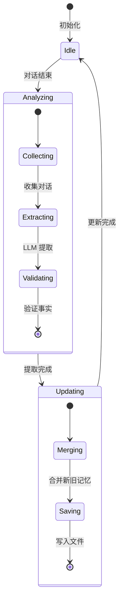
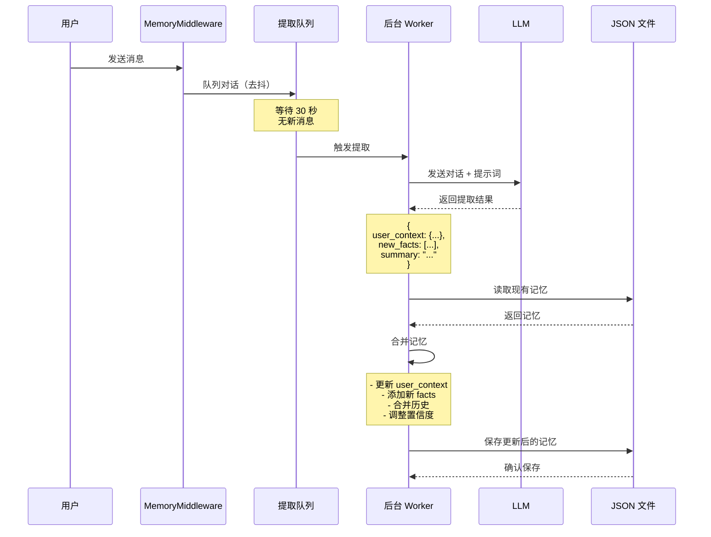
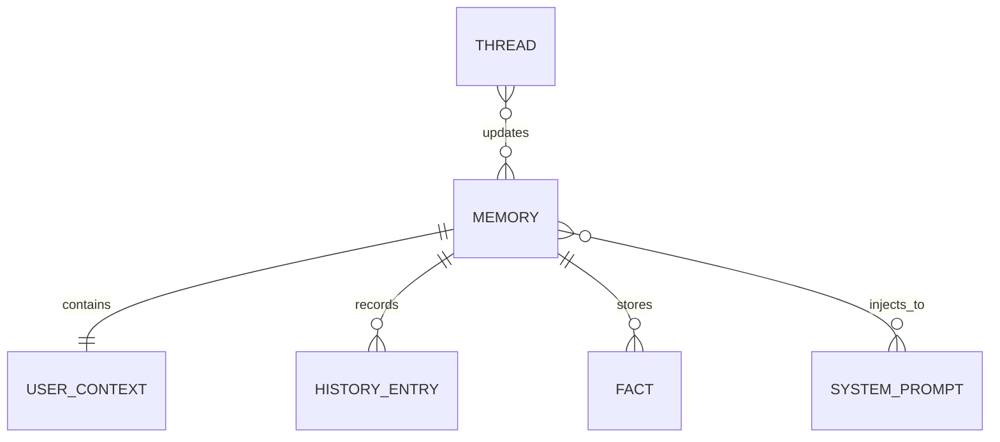

# Memory（记忆）

Memory（记忆）是 DeerFlow 实现跨会话持久化用户上下文和知识的核心系统。
它通过 LLM 驱动的记忆提取，构建用户画像、偏好和累积知识。

## 什么是 Memory？

Memory 是一个持久化的用户知识库，在多次会话之间累积和更新。系统自动分析对话内容，提取用户上下文、事实和偏好，并在后续会话中注入相关记忆，使智能体能够"记住"用户。

**关键特征**:
- **持久化**: 跨会话保存，重启后依然存在
- **自动提取**: LLM 驱动的智能提取
- **结构化存储**: 用户上下文、历史、置信度评分的事实
- **去抖更新**: 批量更新，减少 LLM 调用
- **上下文注入**: 自动注入到系统提示词

## 代码位置

| 方面 | 位置 |
|------|------|
| 记忆提取 | `backend/src/agents/memory/memory.py` |
| 中间件 | `backend/src/agents/middlewares/memory_middleware.py` |
| 配置 | `backend/src/config/memory_config.py` |
| API 端点 | `backend/src/gateway/routes/memory.py` |
| 存储文件 | `~/.deer-flow/memory.json` |

## 结构

```python
# backend/src/agents/memory/memory.py
from pydantic import BaseModel
from typing import Optional
from datetime import datetime

class UserContext(BaseModel):
    """用户上下文信息"""
    work: Optional[str] = None          # 工作背景
    personal: Optional[str] = None      # 个人信息
    top_of_mind: Optional[str] = None   # 当前关注点

class Fact(BaseModel):
    """事实记录"""
    content: str                        # 事实内容
    confidence: float                   # 置信度 (0-1)
    created_at: datetime               # 创建时间
    last_updated: datetime             # 最后更新时间
    source: str                        # 来源（thread_id）

class HistoryEntry(BaseModel):
    """历史记录"""
    timestamp: datetime                # 时间戳
    summary: str                       # 摘要
    thread_id: Optional[str] = None    # 关联的线程 ID

class Memory(BaseModel):
    """完整的记忆结构"""
    user_context: UserContext          # 用户上下文
    history: list[HistoryEntry]        # 历史记录
    facts: list[Fact]                  # 事实列表
    last_updated: datetime             # 最后更新时间
```

### 关键字段

| 字段 | 类型 | 描述 | 用途 |
|------|------|------|------|
| `user_context.work` | `str` | 工作背景 | 了解用户职业和专业领域 |
| `user_context.personal` | `str` | 个人信息 | 了解用户兴趣和偏好 |
| `user_context.top_of_mind` | `str` | 当前关注点 | 了解用户当前目标 |
| `facts[].content` | `str` | 事实内容 | 存储具体知识 |
| `facts[].confidence` | `float` | 置信度 | 判断事实可靠性 |
| `history[].summary` | `str` | 对话摘要 | 记录重要交互 |

## 存储格式

记忆存储在 JSON 文件中：

```json
// ~/.deer-flow/memory.json
{
  "user_context": {
    "work": "软件工程师，专注于 AI 和机器学习",
    "personal": "喜欢阅读科幻小说，热爱户外运动",
    "top_of_mind": "正在学习 LangGraph 和智能体开发"
  },
  "history": [
    {
      "timestamp": "2024-01-15T10:30:00Z",
      "summary": "讨论了 LangGraph 的架构设计和中间件模式",
      "thread_id": "thread-123"
    },
    {
      "timestamp": "2024-01-14T15:00:00Z",
      "summary": "分析了 PDF 文件并生成了研究报告",
      "thread_id": "thread-122"
    }
  ],
  "facts": [
    {
      "content": "用户使用 Python 作为主要编程语言",
      "confidence": 0.95,
      "created_at": "2024-01-10T10:00:00Z",
      "last_updated": "2024-01-15T11:00:00Z",
      "source": "thread-100"
    },
    {
      "content": "用户偏好使用 GPT-4 模型",
      "confidence": 0.85,
      "created_at": "2024-01-12T14:00:00Z",
      "last_updated": "2024-01-14T09:00:00Z",
      "source": "thread-110"
    },
    {
      "content": "用户正在进行一个智能体项目",
      "confidence": 0.90,
      "created_at": "2024-01-15T10:30:00Z",
      "last_updated": "2024-01-15T10:30:00Z",
      "source": "thread-123"
    }
  ],
  "last_updated": "2024-01-15T10:30:00Z"
}
```

## 生命周期



### 状态描述

| 状态 | 描述 | 触发条件 |
|------|------|---------|
| `Idle` | 空闲状态 | 初始状态或更新完成 |
| `Analyzing` | 分析对话 | 对话结束（去抖延迟后） |
| `Updating` | 更新记忆 | 提取完成 |

## 记忆提取流程



## 记忆注入

在每次对话开始时，记忆被注入到系统提示词中：

```python
# 在系统提示词中的位置
SYSTEM_PROMPT = """
You are DeerFlow, an AI assistant with memory capabilities.

<user_memory>
{memory_context}
</user_memory>

{skills_context}

{tools_context}

Current working directory: {workspace_dir}
"""
```

**注入内容**:
- Top facts（按置信度排序）
- 用户上下文
- 最近的对话历史

## 配置

```yaml
# config.yaml
memory:
  enabled: true                        # 是否启用记忆
  file_path: ~/.deer-flow/memory.json  # 存储文件路径
  debounce_seconds: 30                 # 去抖延迟（秒）
  max_history_entries: 50              # 最大历史记录数
  max_facts: 100                       # 最大事实数
  min_confidence: 0.5                  # 最小置信度阈值
```

## 关系



| 关联概念 | 关系 | 描述 |
|---------|------|------|
| Thread | 更新 | 每个线程可能触发记忆更新 |
| System Prompt | 注入 | 记忆被注入到系统提示词 |
| LLM | 提取 | 使用 LLM 提取记忆 |

## API 端点

### 获取记忆

```http
GET /api/memory
```

**响应**:

```json
{
  "user_context": {
    "work": "软件工程师",
    "personal": "喜欢科幻小说",
    "top_of_mind": "学习 LangGraph"
  },
  "history": [...],
  "facts": [...]
}
```

### 重新加载记忆

```http
POST /api/memory/reload
```

**响应**:

```json
{
  "success": true,
  "message": "Memory reloaded successfully"
}
```

### 获取记忆配置

```http
GET /api/memory/config
```

**响应**:

```json
{
  "enabled": true,
  "file_path": "~/.deer-flow/memory.json",
  "debounce_seconds": 30
}
```

## 提取提示词

记忆提取使用精心设计的提示词：

```python
MEMORY_EXTRACTION_PROMPT = """
Analyze the following conversation and extract:

1. **User Context**: Information about the user's background, work, interests, and current focus
2. **New Facts**: Specific facts about the user that can be remembered
3. **Summary**: A brief summary of the conversation

Conversation:
{conversation}

Output format (JSON):
{{
  "user_context": {{
    "work": "...",
    "personal": "...",
    "top_of_mind": "..."
  }},
  "new_facts": [
    {{
      "content": "...",
      "confidence": 0.9
    }}
  ],
  "summary": "..."
}}
"""
```

## 合并逻辑

新提取的记忆与现有记忆合并：

### 用户上下文

```python
def merge_user_context(existing: UserContext, new: UserContext) -> UserContext:
    # 字段级别的合并
    # 如果新值存在，则更新
    return UserContext(
        work=new.work or existing.work,
        personal=new.personal or existing.personal,
        top_of_mind=new.top_of_mind or existing.top_of_mind
    )
```

### 事实

```python
def merge_facts(existing_facts: list[Fact], new_facts: list[Fact]) -> list[Fact]:
    merged = existing_facts.copy()
    
    for new_fact in new_facts:
        # 查找相似的事实
        similar = find_similar_fact(merged, new_fact)
        
        if similar:
            # 更新现有事实的置信度
            similar.confidence = (similar.confidence + new_fact.confidence) / 2
            similar.last_updated = datetime.now()
        else:
            # 添加新事实
            merged.append(new_fact)
    
    # 按置信度排序，保留 top N
    merged.sort(key=lambda f: f.confidence, reverse=True)
    return merged[:MAX_FACTS]
```

### 历史

```python
def add_history(history: list[HistoryEntry], entry: HistoryEntry) -> list[HistoryEntry]:
    history.append(entry)
    
    # 保留最近的 N 条
    return history[-MAX_HISTORY_ENTRIES:]
```

## 缓存机制

记忆系统使用基于 mtime 的缓存：

```python
class MemoryManager:
    def __init__(self):
        self._cache: Optional[Memory] = None
        self._cache_mtime: Optional[float] = None
    
    async def get_memory(self) -> Memory:
        # 检查文件修改时间
        current_mtime = os.path.getmtime(self.file_path)
        
        # 如果缓存有效，直接返回
        if self._cache and self._cache_mtime == current_mtime:
            return self._cache
        
        # 否则重新加载
        self._cache = await self._load_memory()
        self._cache_mtime = current_mtime
        return self._cache
```

## 最佳实践

### 1. 调整去抖时间

```yaml
# 对于频繁交互，增加去抖时间
memory:
  debounce_seconds: 60  # 1 分钟

# 对于稀疏交互，减少去抖时间
memory:
  debounce_seconds: 10  # 10 秒
```

### 2. 管理记忆大小

```yaml
# 限制记忆大小，避免上下文过长
memory:
  max_history_entries: 30
  max_facts: 50
```

### 3. 手动清理记忆

```bash
# 删除记忆文件重新开始
rm ~/.deer-flow/memory.json
```

### 4. 隐私考虑

记忆存储在本地，用户完全控制：
- 可以随时查看记忆内容
- 可以手动编辑或删除
- 不会上传到云端

## 扩展开发

### 自定义提取逻辑

```python
# backend/src/agents/memory/custom_extractor.py
class CustomMemoryExtractor:
    async def extract(self, conversation: str) -> dict:
        # 自定义提取逻辑
        # 例如：特定领域的知识提取
        return {
            "user_context": {...},
            "new_facts": [...],
            "summary": "..."
        }
```

### 添加新的事实类型

```python
# 扩展 Fact 模型
class Fact(BaseModel):
    content: str
    confidence: float
    fact_type: str  # 新增：fact, preference, skill, etc.
    tags: list[str]  # 新增：标签分类
    created_at: datetime
    last_updated: datetime
    source: str
```

## 调试技巧

### 查看当前记忆

```python
from src.agents.memory import MemoryManager

manager = MemoryManager()
memory = await manager.get_memory()

print("User Context:", memory.user_context)
print("Facts:", [f.content for f in memory.facts])
print("History:", [h.summary for h in memory.history])
```

### 强制更新记忆

```python
# 禁用去抖，立即提取
await manager.extract_and_update(thread_id, force=True)
```

### 检查记忆提取日志

```python
import logging

logging.getLogger("src.agents.memory").setLevel(logging.DEBUG)
```

## 常见问题

### 1. 记忆不更新

**问题**: 对话后记忆没有变化

**解决方案**:
1. 检查记忆是否启用：`memory.enabled: true`
2. 检查去抖时间是否过长
3. 查看日志确认提取是否被触发

### 2. 记忆过多

**问题**: 记忆文件过大，影响性能

**解决方案**:
```yaml
memory:
  max_history_entries: 20
  max_facts: 30
```

### 3. 记忆不准确

**问题**: 提取的事实不准确

**解决方案**:
1. 手动编辑记忆文件
2. 调整提取提示词
3. 提高置信度阈值

### 4. 文件权限错误

**问题**: 无法写入记忆文件

**解决方案**:
```bash
# 检查文件权限
ls -la ~/.deer-flow/memory.json

# 修复权限
chmod 644 ~/.deer-flow/memory.json
```
