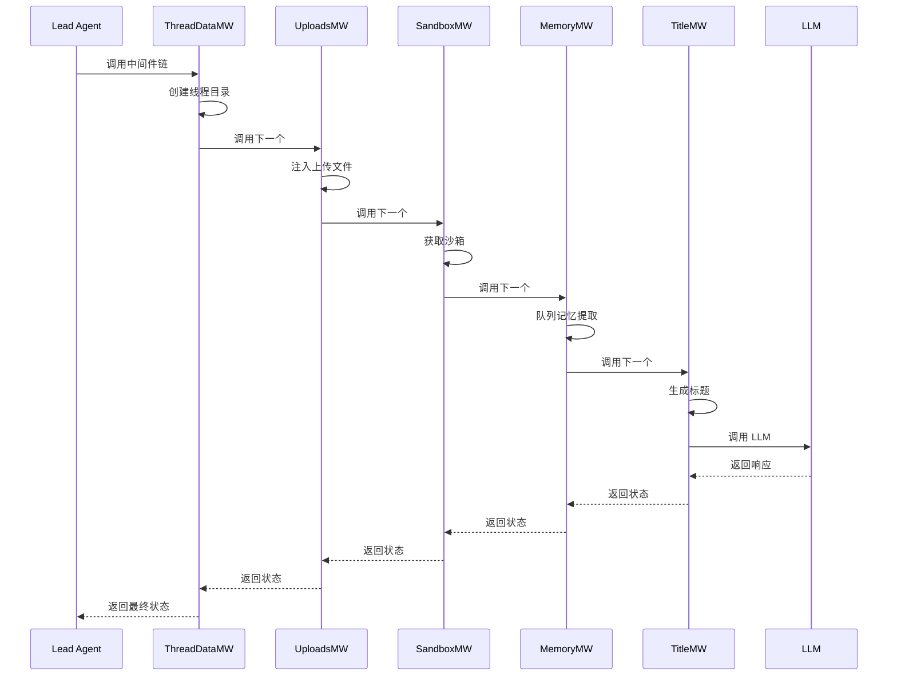

# Middleware（中间件）

Middleware（中间件）是 DeerFlow 中处理横切关注点的核心模式。
每个中间件负责一个特定功能，并通过链式调用传递请求和状态。

## 什么是 Middleware？

Middleware 是一种责任链模式的实现，用于在智能体执行过程中插入可组合的处理逻辑。每个中间件可以：
- 在调用下一个中间件前执行预处理
- 调用下一个中间件
- 在收到响应后执行后处理

**关键特征**:
- **单一职责**: 每个中间件只负责一个功能
- **可组合**: 中间件可以任意组合和排序
- **顺序敏感**: 中间件的执行顺序很重要
- **状态增强**: 可以修改和增强 Thread 状态
- **异步支持**: 所有中间件都是异步的

## 代码位置

| 方面 | 位置 |
|------|------|
| 中间件目录 | `backend/src/agents/middlewares/` |
| 注册逻辑 | `backend/src/agents/lead_agent/agent.py` |
| 基类 | LangGraph AgentMiddleware |

## 中间件链

DeerFlow 的中间件按严格顺序执行：

```
1. ThreadDataMiddleware     → 创建线程隔离目录
2. UploadsMiddleware        → 注入上传文件
3. SandboxMiddleware        → 获取沙箱环境
4. SummarizationMiddleware  → 上下文压缩（可选）
5. TodoMiddleware           → 计划模式任务跟踪（可选）
6. TitleMiddleware          → 自动生成标题
7. MemoryMiddleware         → 异步记忆提取
8. ViewImageMiddleware      → 视觉模型图片注入
9. ClarificationMiddleware  → 拦截澄清请求（必须最后）
```

## 结构

```python
# backend/src/agents/middlewares/base.py
from langchain.agents.middleware import AgentMiddleware
from langchain_core.runnables import RunnableConfig
from src.agents.thread_state import ThreadState

class MyMiddleware(AgentMiddleware):
    """自定义中间件示例"""
    
    async def __call__(
        self, 
        state: ThreadState, 
        config: RunnableConfig
    ) -> ThreadState:
        """执行中间件逻辑
        
        Args:
            state: 当前线程状态
            config: 运行配置
        
        Returns:
            处理后的线程状态
        """
        # 1. 前置处理
        state = self._preprocess(state)
        
        # 2. 调用下一个中间件
        if self.next:
            state = await self.next(state, config)
        
        # 3. 后置处理
        state = self._postprocess(state)
        
        return state
    
    def _preprocess(self, state: ThreadState) -> ThreadState:
        """前置处理逻辑"""
        # 修改状态
        return state
    
    def _postprocess(self, state: ThreadState) -> ThreadState:
        """后置处理逻辑"""
        # 修改状态
        return state
```

## 关键文件

| 文件 | 目的 |
|------|------|
| `thread_data_middleware.py` | 创建线程特定的目录结构（workspace、uploads、outputs） |
| `uploads_middleware.py` | 检测并注入新上传的文件到对话上下文 |
| `sandbox_middleware.py` | 从沙箱管理器获取沙箱环境并注入到状态 |
| `memory_middleware.py` | 将对话排队等待异步记忆提取 |
| `title_middleware.py` | 在首次交互后自动生成对话标题 |
| `view_image_middleware.py` | 为支持视觉的模型注入图片数据 |
| `clarification_middleware.py` | 拦截澄清请求并中断执行（必须最后） |
| `todo_middleware.py` | 在计划模式下跟踪多步骤任务 |
| `subagent_limit_middleware.py` | 限制子智能体的并发数量 |
| `dangling_tool_call_middleware.py` | 处理挂起的工具调用 |

## 依赖

**本模块依赖**:
- `src.agents.thread_state` - 线程状态定义
- `src.config` - 配置管理
- `src.sandbox` - 沙箱系统
- `src.agents.memory` - 记忆系统

**依赖本模块的**:
- `src.agents.lead_agent` - 主智能体
- 所有用户请求都经过中间件链

## 执行流程



## 中间件详解

### 1. ThreadDataMiddleware

**目的**: 为每个线程创建隔离的文件系统结构

**功能**:
- 创建 `{thread_dir}/workspace/` 目录
- 创建 `{thread_dir}/uploads/` 目录
- 创建 `{thread_dir}/outputs/` 目录
- 将路径注入到 Thread 状态

**执行时机**: 始终执行，是最早的中间件

### 2. UploadsMiddleware

**目的**: 检测并通知智能体新上传的文件

**功能**:
- 检查 `uploads/` 目录中的新文件
- 生成文件列表和描述
- 注入到对话上下文

**执行时机**: 有新上传文件时

### 3. SandboxMiddleware

**目的**: 获取沙箱环境供工具使用

**功能**:
- 从沙箱管理器获取沙箱实例
- 注入到 Thread 状态
- 供后续工具访问

**执行时机**: 始终执行

### 4. SummarizationMiddleware（可选）

**目的**: 在接近 token 限制时压缩上下文

**功能**:
- 检测 token 使用量
- 触发压缩时调用 LLM 生成摘要
- 替换旧消息为摘要

**执行时机**: 接近 token 限制时

**配置**:

```yaml
summarization:
  enabled: true
  trigger: [100000, 0.8]  # 超过 100k tokens 或 80% 容量时触发
  keep: [20, 0.2]    # 保留最近 20 条消息或 20%
  model_name: gpt-4  # 用于总结的模型
```

### 5. TodoMiddleware（可选）

**目的**: 在计划模式下跟踪任务进度

**功能**:
- 提供任务列表管理工具
- 跟踪任务状态（pending、in_progress、completed）
- 注入任务上下文到系统提示词

**执行时机**: 计划模式启用时

**触发条件**:

```python
# 在创建智能体时配置
is_plan_mode = config.get("is_plan_mode", False)
todo_middleware = _create_todo_list_middleware(is_plan_mode)
```

### 6. TitleMiddleware

**目的**: 为对话自动生成标题

**功能**:
- 检测首次用户消息
- 调用 LLM 生成标题
- 更新 Thread 元数据

**执行时机**: 首次交互后

### 7. MemoryMiddleware

**目的**: 异步提取用户记忆

**功能**:
- 将对话加入记忆提取队列
- 后台异步处理
- 不阻塞主流程

**执行时机**: 每次对话后

### 8. ViewImageMiddleware

**目的**: 为支持视觉的模型注入图片数据

**功能**:
- 检测模型是否支持视觉
- 读取图片文件并转换为 base64
- 注入到消息中

**执行时机**: 使用视觉模型且有图片引用时

### 9. ClarificationMiddleware（必须最后）

**目的**: 拦截智能体的澄清请求

**功能**:
- 检测 `ask_clarification` 工具调用
- 中断智能体执行
- 返回澄清请求给用户

**执行时机**: 智能体调用 `ask_clarification` 时

**重要**: 必须是最后一个中间件，否则其他中间件可能无法正确处理

## 添加自定义中间件

### 步骤

1. 创建中间件文件：

```python
# backend/src/agents/middlewares/my_middleware.py
from langchain.agents.middleware import AgentMiddleware
from langchain_core.runnables import RunnableConfig
from src.agents.thread_state import ThreadState
import logging

logger = logging.getLogger(__name__)

class MyMiddleware(AgentMiddleware):
    """自定义中间件"""
    
    async def __call__(
        self, 
        state: ThreadState, 
        config: RunnableConfig
    ) -> ThreadState:
        logger.info(f"MyMiddleware processing thread: {state.get('thread_id')}")
        
        # 前置处理
        state["custom_data"] = "my_value"
        
        # 调用下一个中间件
        if self.next:
            state = await self.next(state, config)
        
        # 后置处理
        logger.info("MyMiddleware completed")
        
        return state
```

2. 在 `agent.py` 中注册：

```python
# backend/src/agents/lead_agent/agent.py
from src.agents.middlewares.my_middleware import MyMiddleware

def make_lead_agent(config):
    # ... 创建其他中间件
    
    # 在适当位置插入
    chain = (
        ThreadDataMiddleware()
        | UploadsMiddleware()
        | MyMiddleware()  # 添加你的中间件
        | SandboxMiddleware()
        # ... 其他中间件
    )
    
    return create_agent(
        model=model,
        middleware=chain,
        # ...
    )
```

## 规范

### 文件命名
- 中间件文件: `[name]_middleware.py`
- 类名: `[Name]Middleware`

### 代码模式

**标准中间件模式**:

```python
class StandardMiddleware(AgentMiddleware):
    async def __call__(
        self, 
        state: ThreadState, 
        config: RunnableConfig
    ) -> ThreadState:
        # 1. 前置处理（可选）
        if not self._should_process(state):
            # 跳过处理，直接调用下一个
            if self.next:
                return await self.next(state, config)
            return state
        
        # 2. 执行前置逻辑
        state = self._preprocess(state)
        
        # 3. 调用下一个中间件
        if self.next:
            state = await self.next(state, config)
        
        # 4. 执行后置逻辑
        state = self._postprocess(state)
        
        return state
```

### 错误处理

```python
class SafeMiddleware(AgentMiddleware):
    async def __call__(
        self, 
        state: ThreadState, 
        config: RunnableConfig
    ) -> ThreadState:
        try:
            # 处理逻辑
            if self.next:
                state = await self.next(state, config)
            return state
        except Exception as e:
            logger.error(f"Middleware error: {e}", exc_info=True)
            # 决定是否继续传播错误
            raise
```

### 测试

```python
# tests/middlewares/test_my_middleware.py
import pytest
from src.agents.middlewares.my_middleware import MyMiddleware
from src.agents.thread_state import ThreadState

@pytest.mark.asyncio
async def test_my_middleware():
    middleware = MyMiddleware()
    state = ThreadState(thread_id="test", messages=[])
    
    result = await middleware(state, {})
    
    assert "custom_data" in result
    assert result["custom_data"] == "my_value"
```

## 最佳实践

1. **保持单一职责**: 每个中间件只做一件事
2. **考虑顺序**: 中间件顺序很重要，谨慎插入位置
3. **处理 None**: 检查 `self.next` 是否存在
4. **记录日志**: 使用 `logging` 记录关键操作
5. **错误处理**: 优雅处理异常，避免中断整个链
6. **性能考虑**: 避免在中间件中执行耗时操作
7. **状态不可变**: 尽量返回新的状态对象而不是修改原对象

## 调试技巧

### 启用中间件日志

```python
import logging

# 启用所有中间件的调试日志
logging.getLogger("src.agents.middlewares").setLevel(logging.DEBUG)
```

### 追踪中间件执行

```python
class DebugMiddleware(AgentMiddleware):
    async def __call__(self, state, config):
        print(f"Before: {self.__class__.__name__}")
        if self.next:
            state = await self.next(state, config)
        print(f"After: {self.__class__.__name__}")
        return state
```
