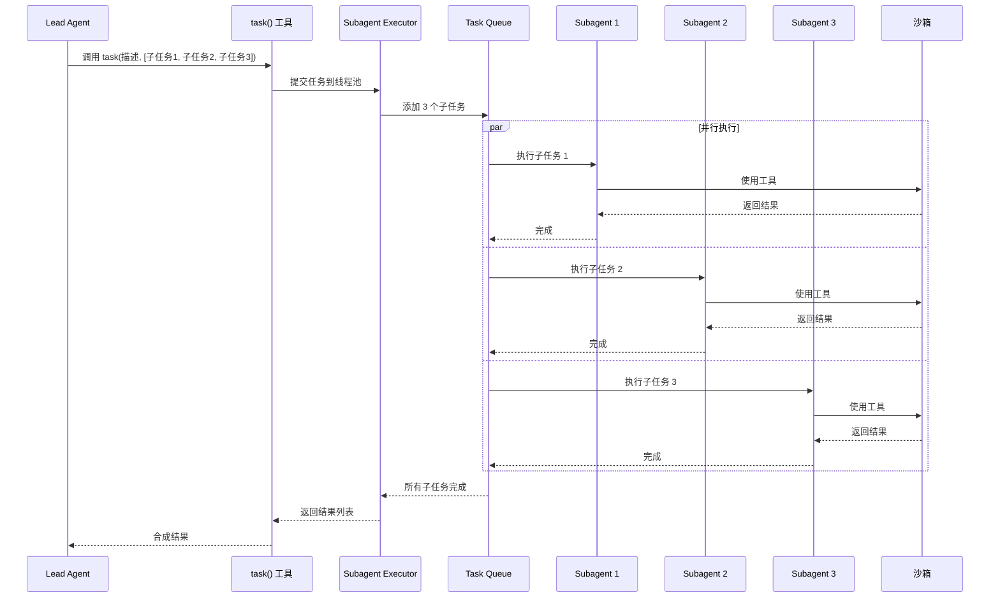
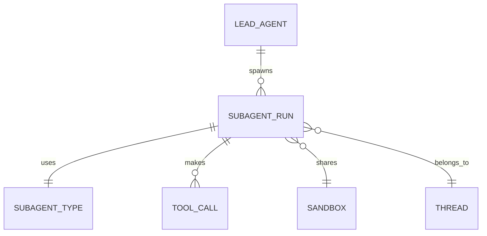

# Subagent（子智能体）

Subagent（子智能体）是 DeerFlow 中实现复杂任务分解和并行执行的核心机制。
主智能体可以将复杂任务分解为多个子任务，委托给子智能体并行执行，然后合成最终结果。

## 什么是 Subagent？

Subagent 是一个独立的智能体实例，拥有自己的上下文、工具集和终止条件。它由主智能体（Lead Agent）动态创建，用于处理特定的子任务。子智能体之间相互隔离，可以并行执行，完成后将结果返回给主智能体。

**关键特征**:
- **上下文隔离**: 每个子智能体运行在独立的上下文中
- **并行执行**: 多个子智能体可以同时运行
- **结果合成**: 主智能体收集并合成所有子智能体的结果
- **工具限定**: 子智能体可以使用完整的工具集或受限的工具集
- **超时控制**: 每个子智能体有独立的超时限制

## 代码位置

| 方面 | 位置 |
|------|------|
| 执行器 | `backend/src/subagents/executor.py` |
| 注册表 | `backend/src/subagents/registry.py` |
| 配置 | `backend/src/subagents/config.py` |
| 内置智能体 | `backend/src/subagents/builtins/` |
| 工具 | `backend/src/tools/builtins/task.py` |

## 结构

```python
# backend/src/subagents/config.py
from dataclasses import dataclass
from langchain_core.language_models import BaseChatModel

@dataclass
class SubagentConfig:
    """子智能体配置"""
    name: str                    # 子智能体名称
    description: str             # 任务描述
    model: BaseChatModel         # 使用的 LLM 模型
    tools: list                  # 可用工具列表
    system_prompt: str           # 系统提示词
    max_iterations: int = 10     # 最大迭代次数
    timeout: int = 900           # 超时时间（秒）
    recursion_limit: int = 50    # 递归深度限制
```

### 关键字段

| 字段 | 类型 | 描述 | 约束 |
|------|------|------|------|
| `name` | `str` | 子智能体标识 | 唯一 |
| `description` | `str` | 任务描述 | 非空 |
| `model` | `BaseChatModel` | LLM 模型 | 必须配置 |
| `tools` | `list` | 工具列表 | 可为空 |
| `timeout` | `int` | 超时时间 | 默认 900 秒（15 分钟） |
| `max_iterations` | `int` | 最大迭代 | 默认 10 次 |

## 内置子智能体

### 1. general-purpose

**目的**: 通用子智能体，可以使用完整工具集

**位置**: `backend/src/subagents/builtins/general_purpose.py`

**特点**:
- 访问所有工具（沙箱、搜索、文件操作等）
- 适合大多数任务
- 灵活性高

**系统提示词片段**:

```
You are a general-purpose subagent. You have access to all tools including:
- bash: Execute commands in sandbox
- read_file, write_file: File operations
- tavily_search: Web search
- jina_ai_fetch: Web page fetching
...
```

### 2. bash

**目的**: 命令专家，专注于执行 shell 命令

**位置**: `backend/src/subagents/builtins/bash_agent.py`

**特点**:
- 只有 bash 工具
- 适合需要复杂命令序列的任务
- 执行效率高

**系统提示词片段**:

```
You are a bash command specialist. You excel at:
- Executing complex command pipelines
- File system operations
- Data processing with command-line tools
...
```

## 执行流程



## 工具接口

### task 工具

主智能体通过 `task` 工具创建子智能体：

```python
# backend/src/tools/builtins/task.py
@tool
def task(description: str, tasks: list[str]) -> str:
    """Create and execute subagent tasks in parallel.
    
    Args:
        description: Overall task description
        tasks: List of subtasks to execute in parallel
    
    Returns:
        Combined results from all subtasks
    
    Example:
        task(
            description="Research AI trends",
            tasks=[
                "Search for latest LLM developments",
                "Find recent AI research papers",
                "Analyze market trends"
            ]
        )
    """
    # 获取执行器
    executor = get_subagent_executor()
    
    # 并行执行子任务
    results = await executor.execute_parallel(
        description=description,
        tasks=tasks,
        config={
            "model": current_model,
            "tools": available_tools,
            "timeout": 900
        }
    )
    
    # 合成结果
    return format_results(results)
```

## 执行器实现

```python
# backend/src/subagents/executor.py
import asyncio
from concurrent.futures import ThreadPoolExecutor
from typing import Any

class SubagentExecutor:
    """子智能体执行器"""
    
    def __init__(self, max_concurrent: int = 3):
        self.max_concurrent = max_concurrent
        self.thread_pool = ThreadPoolExecutor(max_workers=max_concurrent)
        self.registry = get_subagent_registry()
    
    async def execute_parallel(
        self, 
        description: str, 
        tasks: list[str],
        config: dict
    ) -> list[dict[str, Any]]:
        """并行执行多个子任务
        
        Args:
            description: 总体描述
            tasks: 子任务列表
            config: 配置
        
        Returns:
            结果列表
        """
        semaphore = asyncio.Semaphore(self.max_concurrent)
        
        async def run_with_limit(task_desc: str):
            async with semaphore:
                return await self.execute_single(task_desc, config)
        
        # 并行执行所有任务
        coroutines = [run_with_limit(task) for task in tasks]
        results = await asyncio.gather(*coroutines, return_exceptions=True)
        
        # 处理异常
        processed = []
        for i, result in enumerate(results):
            if isinstance(result, Exception):
                processed.append({
                    "task": tasks[i],
                    "status": "error",
                    "error": str(result)
                })
            else:
                processed.append({
                    "task": tasks[i],
                    "status": "success",
                    "result": result
                })
        
        return processed
    
    async def execute_single(self, task: str, config: dict) -> str:
        """执行单个子任务
        
        Args:
            task: 任务描述
            config: 配置
        
        Returns:
            执行结果
        """
        # 创建子智能体
        subagent = self.registry.create("general-purpose", config)
        
        # 执行
        try:
            result = await asyncio.wait_for(
                subagent.invoke({"input": task}),
                timeout=config.get("timeout", 900)
            )
            return result["output"]
        except asyncio.TimeoutError:
            raise TimeoutError(f"Subagent timed out after {config['timeout']}s")
```

## 配置

### 子智能体限制

```yaml
# config.yaml
subagents:
  max_concurrent: 3      # 最大并发数
  default_timeout: 900   # 默认超时（15 分钟）
  max_iterations: 10     # 最大迭代次数
```

### 中间件控制

```python
# backend/src/agents/middlewares/subagent_limit_middleware.py
class SubagentLimitMiddleware(AgentMiddleware):
    """限制子智能体并发数"""
    
    def __init__(self, max_concurrent: int = 3):
        self.max_concurrent = max_concurrent
        self.semaphore = asyncio.Semaphore(max_concurrent)
    
    async def __call__(self, state, config):
        # 检查当前并发数
        if state.get("subagent_count", 0) >= self.max_concurrent:
            # 返回提示，不允许创建更多子智能体
            state["subagent_denied"] = True
            return state
        
        # 增加计数
        state["subagent_count"] = state.get("subagent_count", 0) + 1
        
        # 调用下一个中间件
        if self.next:
            state = await self.next(state, config)
        
        # 减少计数
        state["subagent_count"] -= 1
        
        return state
```

## 状态跟踪

子智能体执行状态通过 SSE 事件推送给前端：

```python
# 事件类型
event: subagent_started
data: {"task_id": "sub-123", "description": "Search for AI trends"}

event: subagent_progress
data: {"task_id": "sub-123", "progress": 50, "message": "Searching..."}

event: subagent_completed
data: {"task_id": "sub-123", "status": "success", "result": "..."}
```

## 关系



| 关联概念 | 关系 | 描述 |
|---------|------|------|
| Lead Agent | 生成 | 主智能体创建子智能体 |
| Tool Call | 执行 | 子智能体调用工具 |
| Sandbox | 共享 | 与主智能体共享沙箱环境 |
| Thread | 属于 | 子智能体运行在同一个 Thread 中 |

## 最佳实践

### 1. 合理拆分任务

```python
# 好的拆分 - 独立可并行的任务
tasks = [
    "Search for recent LLM papers",
    "Search for AI market trends",
    "Search for new AI tools"
]

# 不好的拆分 - 有依赖关系的任务
tasks = [
    "Search for papers",          # 需要先完成
    "Summarize the papers found"  # 依赖前一个结果
]
```

### 2. 控制并发数

```python
# 不要创建太多子智能体
# 推荐最多 3-5 个并发
task(
    description="Research",
    tasks=[task1, task2, task3]  # 3 个比较合适
)

# 避免这样
task(
    description="Research",
    tasks=[task1, task2, task3, task4, task5, task6, task7, task8]  # 太多
)
```

### 3. 设置合理的超时

```yaml
# config.yaml
subagents:
  default_timeout: 900  # 15 分钟
  # 对于简单任务可以更短
  quick_task_timeout: 300  # 5 分钟
```

### 4. 错误处理

```python
# 子智能体可能失败，需要处理
results = await execute_subagents(tasks)

for result in results:
    if result["status"] == "error":
        logger.error(f"Subtask failed: {result['error']}")
        # 可以重试或使用备用方案
```

## 扩展开发

### 添加自定义子智能体

1. 创建子智能体：

```python
# backend/src/subagents/builtins/my_agent.py
from src.subagents.config import SubagentConfig

def create_my_agent(config: SubagentConfig):
    """创建自定义子智能体"""
    
    # 定义工具集
    tools = [
        bash_tool,
        read_file_tool,
        write_file_tool,
        # ... 自定义工具
    ]
    
    # 定义系统提示词
    system_prompt = """
    You are a specialized subagent for [specific purpose].
    ...
    """
    
    # 创建智能体
    from langchain.agents import create_agent
    
    agent = create_agent(
        model=config.model,
        tools=tools,
        system_prompt=system_prompt,
        max_iterations=config.max_iterations
    )
    
    return agent
```

2. 注册到注册表：

```python
# backend/src/subagents/registry.py
from src.subagents.builtins.my_agent import create_my_agent

BUILTIN_AGENTS = {
    "general-purpose": create_general_purpose_agent,
    "bash": create_bash_agent,
    "my-agent": create_my_agent,  # 添加
}
```

## 调试技巧

### 启用子智能体日志

```python
import logging

logging.getLogger("src.subagents").setLevel(logging.DEBUG)
```

### 追踪子智能体执行

```python
# 在执行器中添加日志
class SubagentExecutor:
    async def execute_single(self, task, config):
        logger.debug(f"Starting subagent for: {task}")
        result = await subagent.invoke({"input": task})
        logger.debug(f"Subagent completed: {result}")
        return result
```

### 查看子智能体状态

```python
# 通过中间件查看当前并发数
state = await get_thread_state(thread_id)
print(f"Active subagents: {state.get('subagent_count', 0)}")
```

## 常见问题

### 1. 子智能体超时

**问题**: 子智能体执行超时

**解决方案**:
```yaml
# 增加超时时间
subagents:
  default_timeout: 1800  # 30 分钟
```

### 2. 并发数限制

**问题**: 提示已达到最大并发数

**解决方案**:
```yaml
# 增加并发限制
subagents:
  max_concurrent: 5
```

### 3. 上下文隔离

**问题**: 子智能体无法访问主智能体的上下文

**说明**: 这是设计如此，子智能体运行在隔离上下文中。如果需要共享信息，应该：
- 通过任务描述传递必要信息
- 通过共享文件系统传递数据
