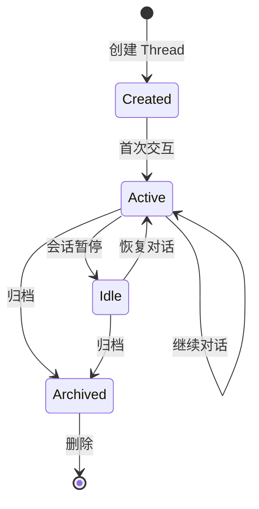
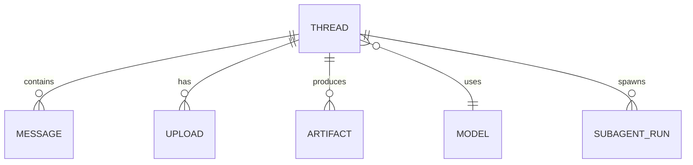

# Thread（线程/会话）

Thread（线程）是 DeerFlow 中用户与智能体交互的核心概念。每个 Thread 代表一个独立的对话会话，拥有隔离的文件系统、状态和上下文。

## 什么是 Thread？

Thread 是用户与 AI 智能体之间的一次完整交互会话。它包含对话历史、工作文件、生成的制品，以及会话特定的配置。每个 Thread 都有唯一标识符，并且彼此完全隔离。

**关键特征**:
- **隔离性**: 每个 Thread 拥有独立的文件系统空间
- **持久化**: Thread 状态被持久化存储，支持跨会话恢复
- **可追踪**: 完整的对话历史和状态变更记录
- **可配置**: 支持 Thread 级别的模型和参数配置

## 代码位置

| 方面 | 位置 |
|------|------|
| 状态定义 | `backend/src/agents/thread_state.py` |
| 数据管理 | LangGraph StateGraph |
| 存储层 | `backend/src/agents/checkpointer/` |
| 前端管理 | `frontend/src/core/threads/` |
| API 端点 | `backend/src/gateway/routes/` |

## 结构

```python
# backend/src/agents/thread_state.py
class ThreadState(TypedDict):
    thread_id: str              # 唯一标识
    messages: list[Message]     # 对话历史
    workspace_dir: str          # 工作目录路径
    uploads_dir: str            # 上传文件目录
    outputs_dir: str            # 输出文件目录
    model_name: str             # 使用的模型
    thinking_enabled: bool      # 是否启用思考模式
    is_plan_mode: bool          # 是否启用计划模式
    subagent_enabled: bool      # 是否启用子智能体
    # ... 其他状态字段
```

### 关键字段

| 字段 | 类型 | 描述 | 约束 |
|------|------|------|------|
| `thread_id` | `str` | 唯一标识 | UUID 格式，不可变 |
| `messages` | `list[Message]` | 对话历史 | LangChain 消息格式 |
| `workspace_dir` | `str` | 工作目录 | 每个线程独立 |
| `model_name` | `str` | 模型名称 | 必须在配置中定义 |
| `thinking_enabled` | `bool` | 思考模式 | 仅支持特定模型 |

## 不变量

这些规则对有效的 Thread 必须始终成立：

1. **唯一性**: 每个 `thread_id` 在系统中必须唯一
   - 示例：不能存在两个相同 ID 的 Thread

2. **目录隔离**: 每个 Thread 的目录必须独立且不重叠
   - 示例：`/workspace/thread-1` 和 `/workspace/thread-2` 不能共享文件

3. **状态一致性**: Thread 状态必须与持久化存储保持同步
   - 示例：调用 checkpoint 后，状态必须可恢复

4. **消息顺序性**: 消息列表必须按时间顺序排列
   - 示例：不能有消息的时间戳早于前一条消息

## 生命周期



### 状态描述

| 状态 | 描述 | 允许的转换 |
|------|------|-----------|
| `Created` | 初始状态，已创建但未使用 | → Active |
| `Active` | 活跃对话中 | → Active, Idle, Archived |
| `Idle` | 会话暂停，状态保留 | → Active, Archived |
| `Archived` | 已归档，只读 | → (终态) |

## 文件系统结构

每个 Thread 拥有三个独立的目录：

```
~/.deer-flow/threads/{thread_id}/
├── workspace/        # 智能体工作目录
│   ├── data.json
│   ├── analysis.py
│   └── temp/
├── uploads/          # 用户上传的文件
│   ├── report.pdf
│   ├── report.md     # PDF 转换后的 Markdown
│   └── images/
└── outputs/          # 生成的最终制品
    ├── presentation.pptx
    ├── summary.pdf
    └── results.json
```

**沙箱虚拟路径映射**:
- 容器内 `/mnt/user-data/workspace/` → `workspace/`
- 容器内 `/mnt/user-data/uploads/` → `uploads/`
- 容器内 `/mnt/user-data/outputs/` → `outputs/`

## 关系



| 关联概念 | 关系 | 描述 |
|---------|------|------|
| Message | 包含 | 一个 Thread 包含多条消息 |
| Upload | 拥有 | 一个 Thread 可有多个上传文件 |
| Artifact | 产生 | 一个 Thread 可产生多个制品 |
| Model | 使用 | 每个 Thread 使用一个模型 |
| SubagentRun | 生成 | 一个 Thread 可生成多个子智能体运行 |

## 使用示例

### 创建新 Thread

```python
from src.client import DeerFlowClient

client = DeerFlowClient()

# 自动创建新 Thread
response = client.chat("你好，帮我分析数据")

# 指定 Thread ID
response = client.chat("继续分析", thread_id="my-custom-id")
```

### 获取 Thread 状态

```python
# 通过 LangGraph API
state = await client.get_thread_state(thread_id="thread-123")
print(state["messages"])
```

### 恢复 Thread

```python
# 恢复之前的对话
response = client.chat(
    "基于之前的分析，生成报告",
    thread_id="thread-123"
)
```

## 前端集成

在 Next.js 前端中，Thread 通过 TanStack Query 和自定义 Hooks 管理：

```typescript
// frontend/src/core/threads/use-thread.ts
import { useThread } from '@/core/threads'

function MyComponent() {
  const { thread, isLoading, error } = useThread(threadId)
  
  if (isLoading) return <Loading />
  if (error) return <Error />
  
  return (
    <div>
      <h1>Thread: {thread.id}</h1>
      <MessageList messages={thread.messages} />
    </div>
  )
}
```

## 最佳实践

1. **Thread ID 管理**: 使用有意义的 Thread ID 或让系统自动生成
2. **定期归档**: 长时间不用的 Thread 应该归档以节省资源
3. **文件清理**: 及时清理不需要的上传文件和工作文件
4. **状态检查**: 定期检查 Thread 状态，避免状态不一致
